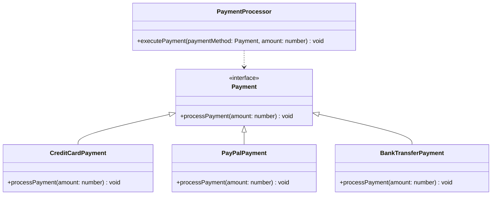

```mermaid
classDiagram
    Payment <|-- CreditCardPayment
    Payment <|-- PayPalPayment
    Payment <|-- BankTransferPayment
    PaymentProcessor ..> Payment

    class Payment {
        <<interface>>
        +processPayment(amount: number) void
    }

    class PaymentProcessor {
        +executePayment(paymentMethod: Payment, amount: number) void
    }

    class CreditCardPayment {
        +processPayment(amount: number) void
    }

    class PayPalPayment {
        +processPayment(amount: number) void
    }

    class BankTransferPayment {
        +processPayment(amount: number) void
    }
```